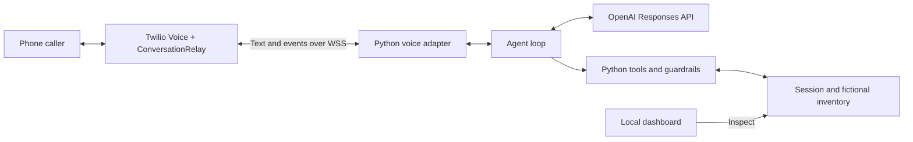

# JEFF

**Journey Experience & Flight Facilitator** — my first voice agent.

JEFF helps a stranded traveler find a replacement flight over a normal phone call. It understands preferences, searches eligible inventory, proposes a flight and seat, and updates a simulated reservation after the traveler agrees.

Built with **Python, FastAPI, Twilio ConversationRelay, and the OpenAI Responses API**, with a small **Vite dashboard** for inspecting the conversation and tool activity.

> This is a portfolio demo with fictional airline data. It has no airline affiliation and cannot make real bookings. The original hosted phone demo has been retired; run it locally with your own accounts and credentials.

## What it demonstrates

- Natural conversation and tool selection driven by an LLM, without a scripted conversation mode.
- Multiple reservations and routes using the same function-based agent loop.
- Structured working state alongside a bounded conversation history.
- Natural-language approval of a specific proposal, followed by Python checks before a booking change.
- Twilio webhook signature checks, a caller allowlist, and interruption handling.
- An operator dashboard showing transcripts, flight options, booking state, and tool events.
- Failure scenarios for unavailable seats, inventory changing before confirmation, and service errors.

The greeting and transaction summaries use application-generated wording to keep critical facts consistent with state. The LLM handles the surrounding conversation. Human handoff is simulated; SMS, RCS, and customer confirmation links are not implemented.

## The experience

1. Call the configured Twilio number. Jeff greets you and asks how he can help.
2. Explain that your flight was canceled and provide reservation code `XK72LP`.
3. Ask for what matters: “Get me home as early as possible” or “I’d prefer an aisle seat.”
4. Jeff searches the fixture inventory and reads out a specific flight and seat.
5. Reply naturally, such as “Yeah, let’s do it.” The backend validates and commits that proposal.
6. Ask a follow-up question. The dashboard shows the updated simulated itinerary and tool activity.

Choosing an option is separate from approving the booking. A recommendation alone does not change the reservation.

## Architecture



ConversationRelay handles speech recognition and speech synthesis. Python works with text, maintains the session, and executes the business operations. The model chooses permitted tools; an internal commit function rechecks the exact proposal and inventory before changing a reservation.

See [the architecture guide](docs/ARCHITECTURE.md) for tool contracts, context, state, approval, and runtime boundaries.

```text
backend/
  main.py              FastAPI apps, settings, and server startup
  voice.py             Twilio webhook, WebSocket, and interruptions
  core/
    loop.py            Model/tool loop and approval interpretation
    context.py         Prompt, scoped facts, recent history, tool schemas
    session.py         In-memory conversation and working state
    tools.py           Lookup, preferences, search, proposal, and booking
    guardrails.py      Eligibility and exact-proposal validation
    prompt.md          Jeff's identity, behavior, and limits
  data/demo.json       Fictional passengers, flights, and recovery policy
  tests/               Offline model-boundary, recovery, and transport tests
  .env.example         Credential-free configuration template
frontend/              Vite operator dashboard
```

## Run locally

Prerequisites: Python 3.14 (the tested version), Node.js 22.12 or newer, and an OpenAI API key with access to a Responses API model compatible with the configured reasoning and structured-output options. Phone calls also require a Twilio number with ConversationRelay enabled and an HTTPS/WSS tunnel such as ngrok. Provider usage may incur charges.

```sh
git clone https://github.com/realvivekganta/JEFF.git
cd JEFF
python3 -m venv backend/.venv
backend/.venv/bin/python -m pip install -r backend/requirements.txt
npm --prefix frontend ci
npm --prefix frontend run build
cp backend/.env.example backend/.env
```

Use the copy command for first-time setup only. Fill in your own credentials in `backend/.env`; never commit it.

| Variable | Purpose |
|---|---|
| `OPENAI_API_KEY` | Your OpenAI API key |
| `OPENAI_MODEL` | Model ID; the example retains the original demo's `gpt-5.6-luna` setting |
| `PORT` | Local dashboard port, default `3100` |
| `VOICE_PORT` | Voice listener port, default `3101` |
| `PUBLIC_BASE_URL` | Your exact public HTTPS tunnel origin, without a trailing slash |
| `TWILIO_AUTH_TOKEN` | Validates incoming Twilio requests |
| `DEMO_CALLER_NUMBER` | Allowed calling number in E.164 format |
| `NGROK_AUTHTOKEN` | Your ngrok agent token, used by the launcher below |

The model setting is configurable. Check availability in your own account and compatibility before substituting another model. No API keys or paid accounts are needed for the offline tests.

Start the backend from the project root:

```sh
backend/.venv/bin/python -B backend/main.py
```

Open **http://127.0.0.1:3100**. With only the OpenAI settings configured, the dashboard supports text conversations with the same agent. It still makes live model requests. Build the frontend even if you only plan to use the phone interface.

For phone calls, configure the voice settings and start ngrok in another terminal:

```sh
backend/.venv/bin/python -B -c 'from dotenv import load_dotenv; import os; load_dotenv("backend/.env"); os.execvp("ngrok", ["ngrok", "http", os.getenv("VOICE_PORT", "3101"), "--url", os.environ["PUBLIC_BASE_URL"]])'
```

In Twilio, set your number's incoming-call webhook to **POST** `https://YOUR-NGROK-DOMAIN/voice`. Enable ConversationRelay and complete its required account onboarding. Call from the allowlisted number. Tunnel only the voice port; keep the operator dashboard local.

Restart Python after changing environment settings, Python code, or the prompt. Rebuild the frontend after UI edits. For frontend development, `npm --prefix frontend run dev` starts Vite on port 5173 and proxies API calls to the backend.

## Sample data

| Reservation | Disruption | Recovery examples |
|---|---|---|
| `XK72LP` | Canceled IAD–ATL flight | DL2219, 7:10–8:48 PM, window 14A; DL2285, 9:00–10:40 PM, aisle 18C |
| `BOS842` | Canceled JFK–BOS flight | DL512, 7:00–8:15 PM, aisle 12C; DL618, 8:30–9:45 PM, window 9A |
| `ORD631` | Delayed JFK–ORD flight | Simulated human review |

All records are fictional, including airline-style flight identifiers. Times use each airport's local timezone. A fixed September 18, 2026 demo clock keeps the fixture reproducible on later dates.

Choose a failure scenario in the dashboard and reset before the next call. Every call starts a fresh, unidentified session. Loading a reservation in the dashboard does not preload the next phone call.

## Checks

```sh
(cd backend && .venv/bin/python -B -m pytest -q -p no:cacheprovider)
npm --prefix frontend run build
```

The automated suite uses mocked model responses and signed local Twilio fixtures. It checks tool validation, scoped context, multiple routes, approval, stale inventory, interruption, failures, and transport behavior. GitHub Actions runs the tests and frontend build without provider credentials.

The original demo also completed live calls and model checks. These are development checks, not evidence of production reliability or a measured latency guarantee.

## Design choices and limits

- **Functions and dictionaries:** the core agent avoids an Agent/Session class hierarchy.
- **Explicit state:** important booking facts persist outside the last 40 transcript messages sent to the model. There is no compaction loop.
- **Constrained operations:** Python enforces same-day, same-route cancellation recovery and rechecks inventory at commit. This is a deliberately narrow business workflow.
- **One active call:** state and inventory live in memory and disappear when the process stops. The app is not designed for multiple workers or concurrent customers.
- **Probabilistic interpretation:** structured output constrains format, not semantic correctness. Approval interpretation still requires evaluation.
- **Voice latency:** responses currently return as complete turns rather than streaming tokens.
- **Identity:** the caller allowlist and confirmation code are demo controls, not production passenger authentication.

Future work includes real airline APIs, passenger verification, transactional inventory, durable idempotency and sessions, real human transfer, latency instrumentation and streaming, and optional post-booking notifications.

## Shutdown and account cleanup

Stop the Python process and ngrok with Ctrl+C. Revoke any dedicated demo API keys, remove local credentials, and release unused Twilio numbers. Check messaging campaigns and paid provider plans separately; stopping the app does not cancel account-level subscriptions or remove pre-purchased credit.

## References

- [Twilio ConversationRelay](https://www.twilio.com/docs/voice/conversationrelay)
- [ConversationRelay WebSocket protocol](https://www.twilio.com/docs/voice/conversationrelay/websocket-messages)
- [OpenAI function calling](https://developers.openai.com/api/docs/guides/function-calling)
